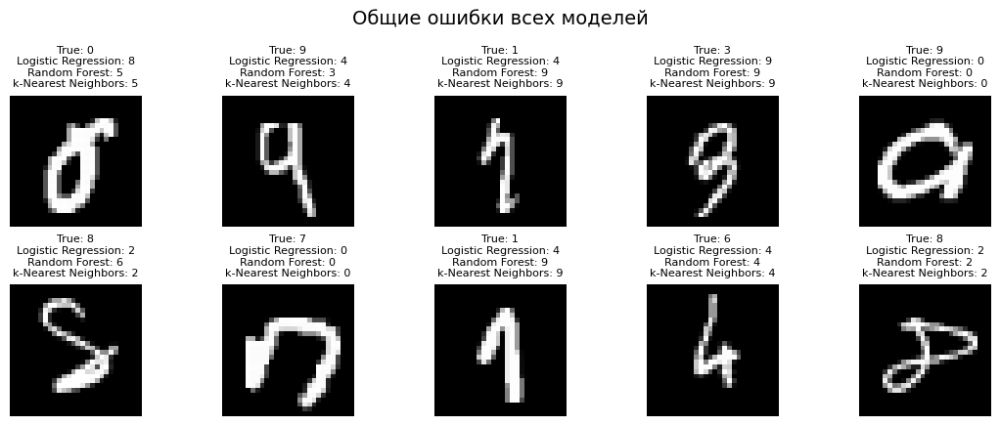
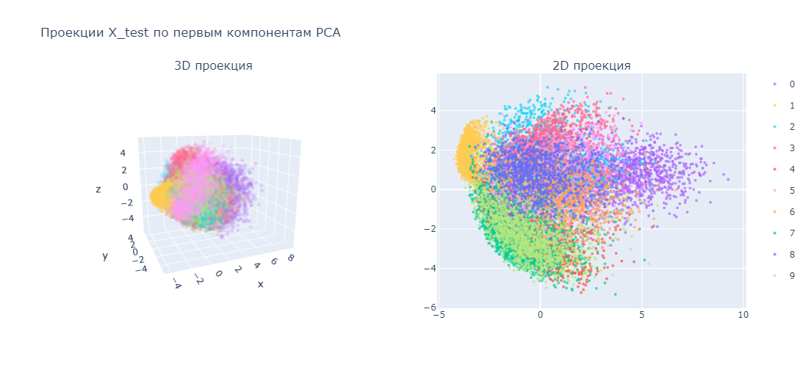

# 🎯 MNIST Digit Classification Project



## 📋 Описание проекта

Этот проект представляет собой решение для классификации рукописных цифр с использованием набора данных MNIST. Проект демонстрирует применение различных алгоритмов машинного обучения и их оптимизацию для достижения максимальной точности распознавания.

### 🎯 Цели проекта
- Реализовать и сравнить различные алгоритмы классификации
- Оптимизировать гиперпараметры моделей с помощью GridSearchCV
- Провести детальный анализ производительности моделей
- Создать визуализации для интерпретации результатов

## 📊 Алгоритмы и результаты

| Алгоритм | Точность | Время обучения | Особенности |
|----------|----------|----------------|-------------|
| **Logistic Regression** | ~98.0% | Быстро | Линейная модель, хорошая интерпретируемость |
| **Random Forest** | ~95% | Средне | Ансамбль деревьев, устойчивость к переобучению |
| **K-Nearest Neighbors** | ~98% | Медленно | Непараметрический метод, высокая точность |

## 🛠 Технологический стек

- **Python 3.8+**
- **Scikit-learn** - машинное обучение
- **NumPy** - численные вычисления
- **Matplotlib/Seaborn** - визуализация данных
- **Pandas** - обработка данных

## 📁 Структура проекта

```
ml_models_mnist_digits/
├── README.md                 # Документация проекта
├── mnist_digits.ipynb        # Основной Jupyter notebook
└── requirements.txt          # Зависимости проекта
```

## 🚀 Быстрый старт

### 1. Установка зависимостей
```bash
pip install -r requirements.txt
```

### 2. Запуск проекта
```bash
jupyter notebook mnist_digits.ipynb
```

### 3. Структура выполнения
1. **Загрузка данных** - получение и исследование MNIST датасета
2. **Предобработка** - нормализация и подготовка данных
3. **Базовые модели** - обучение стандартных алгоритмов
4. **Оптимизация** - GridSearchCV для поиска лучших параметров
5. **Анализ результатов** - сравнение и визуализация

## 📈 Ключевые результаты

### Визуализация данных
- Анализ распределения классов
- Примеры изображений цифр
- Статистика датасета

### Оптимизация моделей
- **Random Forest**: Оптимизация количества деревьев, глубины, параметров разделения
- **KNN**: Подбор оптимального количества соседей, метрики расстояния, весов

### Метрики качества
- Accuracy Score
- Classification Report
- Время обучения и предсказания

## 🔍 Детальный анализ

### Предобработка данных
- Нормализация пикселей (0-255 → 0-1)
- One-Hot Encoding для меток (опционально)
- Разделение на train/test (80/20)

### Оптимизация гиперпараметров
```python
# Random Forest
rf_param_grid = {
    'n_estimators': [50, 100, 200],
    'max_depth': [10, 20, None],
    'min_samples_split': [2, 5, 10],
    'min_samples_leaf': [1, 2, 4]
}

# KNN
knn_param_grid = {
    'n_neighbors': [3, 5, 7, 9, 11],
    'weights': ['uniform', 'distance'],
    'metric': ['euclidean', 'manhattan', 'minkowski']
}
```

## 📊 Визуализации



Проект включает следующие типы визуализаций:

1. **Распределение классов** - гистограммы и круговые диаграммы
2. **Примеры изображений** - визуализация исходных данных
3. **Confusion Matrix** - матрицы ошибок для каждой модели
4. **Feature Importance** - важность признаков (для Random Forest)
5. **Сравнение моделей** - графики точности и времени обучения

## 🔮 Возможные улучшения

- Добавление нейронных сетей (CNN)
- Применение методов снижения размерности (PCA, t-SNE)
- Реализация кросс-валидации с временными рядами
- Добавление метрик качества (Precision, Recall, F1-Score)
- Создание веб-интерфейса для интерактивного тестирования

## 📝 Заключение

Проект успешно демонстрирует применение различных алгоритмов машинного обучения для классификации изображений. Достигнута высокая точность распознавания (>96%) с оптимизированными параметрами. Результаты показывают, что непараметрические методы (KNN) могут превосходить ансамблевые алгоритмы на данном типе задач.

---
